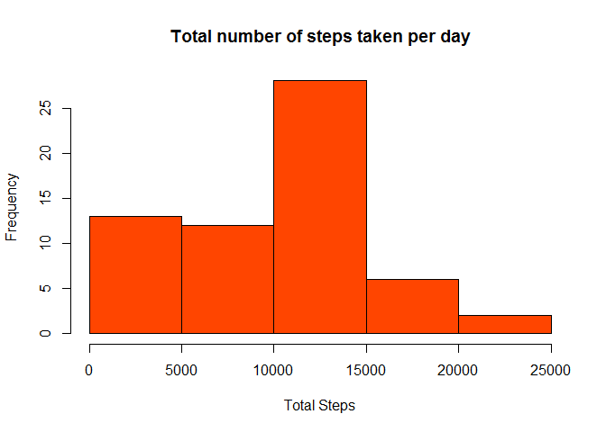
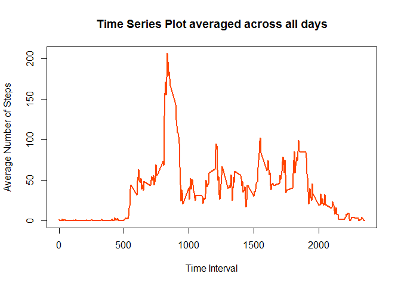
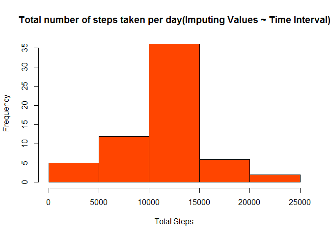
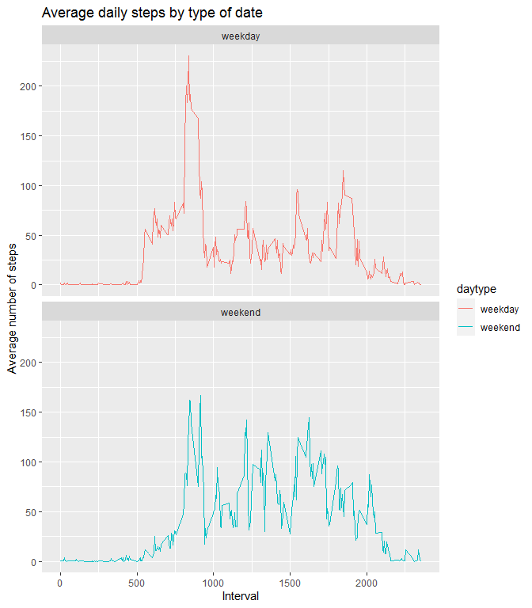

## Loading and preprocessing the data

  
Here we first *unzip* the data required for analysis from the **ZIP File : activity.zip** and read the data into R by using the *read.csv()* function.  
We transform the data into a format suitable for our analysis.  

Here's the code chunk for loading and perprocessing the data :


```r
unzip("activity.zip")
activityData <- read.csv("activity.csv", na.strings = "NA")
activityData$date <- as.Date(activityData$date, "%Y-%m-%d")
activityData$day <- weekdays(activityData$date)
head(activityData)
```

```
##   steps       date interval    day
## 1    NA 2012-10-01        0 Monday
## 2    NA 2012-10-01        5 Monday
## 3    NA 2012-10-01       10 Monday
## 4    NA 2012-10-01       15 Monday
## 5    NA 2012-10-01       20 Monday
## 6    NA 2012-10-01       25 Monday
```


## What is mean total number of steps taken per day?

Now that we've loaded the data for our analysis into R, let us find out the mean number of steps taken per day.  
Here's the code chunk for our analysis :


```r
totalSteps <- with(activityData, tapply(steps, date, sum, na.rm = TRUE))
hist(totalSteps, col = "orangered", xlab = "Total Steps", main = "Total number of steps taken per day")
```

<!-- -->

**Difference between a histogram and a barplot!**  

*With bar charts, each column represents a group defined by a categorical variable; and with histograms, each column represents a group defined by a continuous, quantitative variable.*


```r
meanSteps <- mean(totalSteps)
medianSteps <- median(totalSteps)
```

The **mean** of the total number of steps taken per day is **9354.2295082**

The **median** of the total number of steps taken per day is **10395**

## What is the average daily activity pattern?


```r
activityPattern <- with(activityData, tapply(steps, interval, mean, na.rm = TRUE))
plot(names(activityPattern), activityPattern, type = "l", lwd = 2, col = "orangered", xlab = "Time Interval", ylab = "Average Number of Steps", main = "Time Series Plot averaged across all days")
```

<!-- -->


```r
maxInterval <- names(which.max(activityPattern))
```

On average across all the days in the dataset, the maximum number of steps in a 5-minute interval is at **835**

## Imputing missing values


```r
totalNA <- sum(is.na(activityData$steps))
```

There are in total **2304** missing values in the dataset.
  
Now, we impute the NA values with the mean obtained from the time interval for that particular record.


```r
newactivityData <- activityData
stepMean <- tapply(activityData$steps, activityData$interval, mean, na.rm = TRUE)
newactivityData$steps[is.na(newactivityData$steps)] <- stepMean[match(newactivityData$interval[is.na(newactivityData$steps)], names(stepMean))]
totalSteps1 <- with(newactivityData, tapply(steps, date, sum, na.rm = TRUE))
hist(totalSteps1, col = "orangered", xlab = "Total Steps", main = "Total number of steps taken per day(Imputing Values ~ Time Interval)")
```

<!-- -->


```r
newmeanSteps <- mean(totalSteps1)
newmeanSteps
```

```
## [1] 10766.19
```

The **mean** of the total number of steps taken per day is **1.0766189\times 10^{4}**


```r
newmedianSteps <- median(totalSteps1)
newmedianSteps
```

```
## [1] 10766.19
```

The **median** of the total number of steps taken per day is **1.0766189\times 10^{4}**

## Are there differences in activity patterns between weekdays and weekends?


```r
library(ggplot2)
```

```
## Warning: package 'ggplot2' was built under R version 3.5.3
```

```r
logical <- newactivityData$day == "Saturday" | newactivityData$day == "Sunday"
newactivityData$daytype[logical] <- "weekend"
newactivityData$daytype[!logical] <- "weekday"
daytypePlot <- aggregate(steps ~ daytype + interval, data = newactivityData, mean)
plot<- ggplot(daytypePlot, aes(x = interval , y = steps, color = daytype)) +
       geom_line() +
       labs(title = "Average daily steps by type of date", x = "Interval", y = "Average number of steps") +
       facet_wrap(~daytype, ncol = 1, nrow=2)
print(plot)
```

<!-- -->
